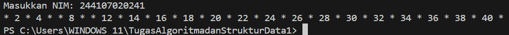
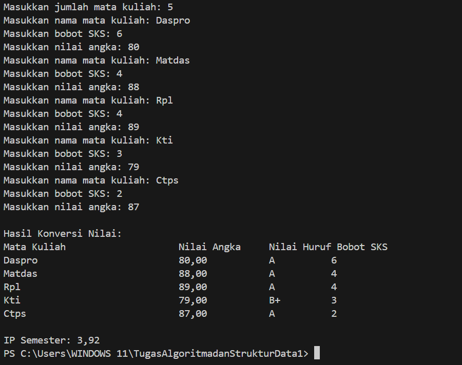
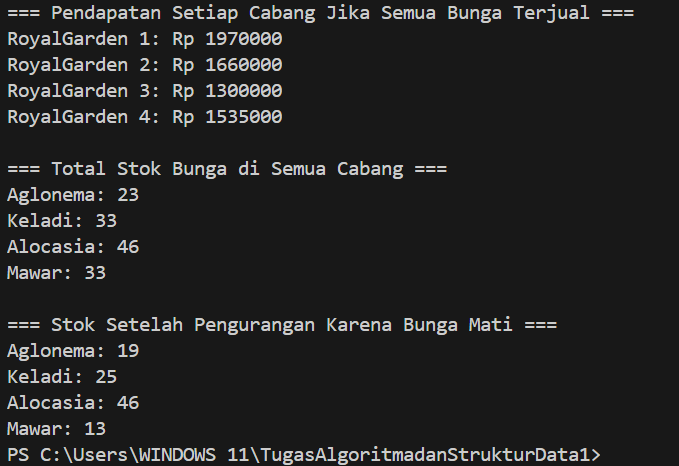
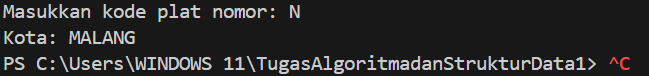
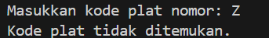
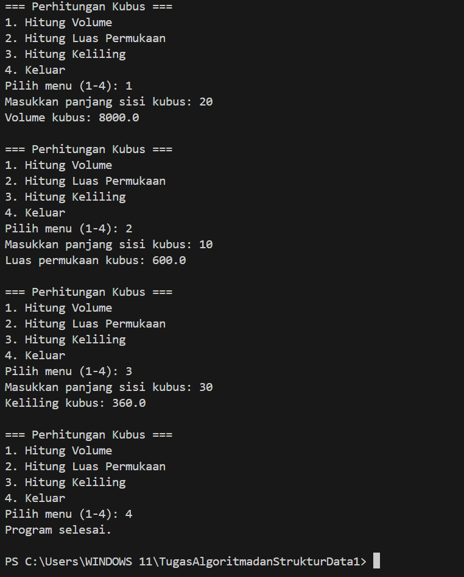
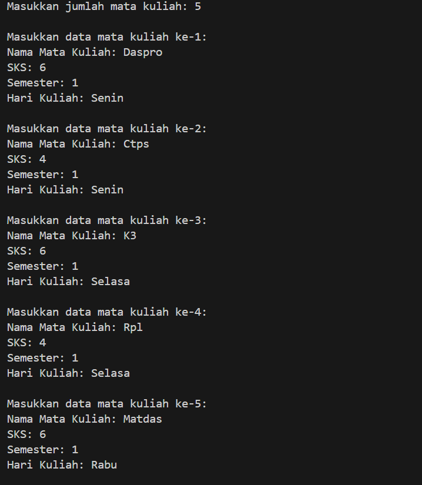
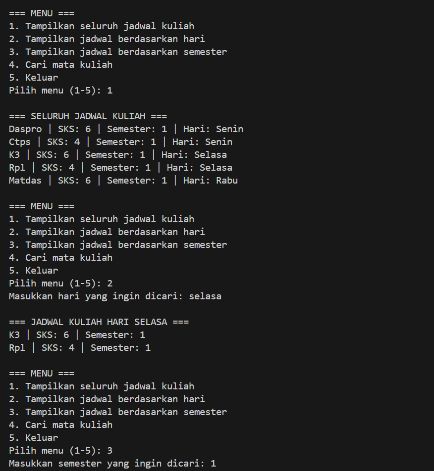
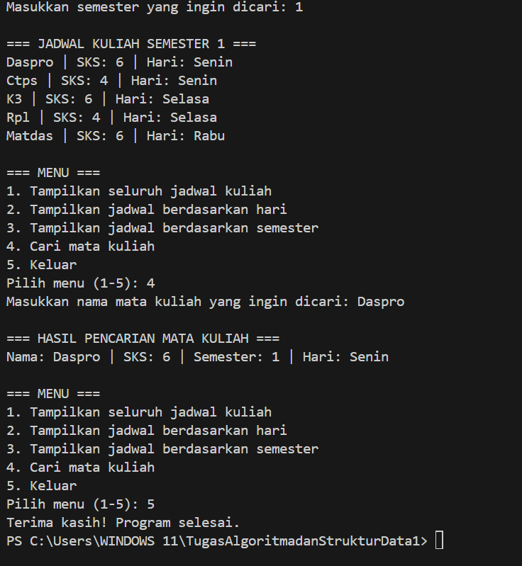

|  | Algorithm and Data Structure |
|--|--|
| NIM |  244107020241|
| Nama |  Andy Otani Dipo Yudho |
| Kelas | TI - 1H |
| Repository | [link] (https://github.com/andyotani/ALSD-sem2/blob/main/Jobsheet1/REPORT.md) |

# Labs #1 Programming Fundamentals Review

## 2.1.1. Selection Solution

The solution is implemented in Pemilihan.java, and below is screenshot of the result.

**Brief explanaton:** There are 4 main step: 
1. Input all grades
2. Validate the input
3. Calculate and convert the final grade
4. Decide the final status

## 2.2.1. Selection Solution
The solution is implemented in Perulangan.java, and below is screenshot of the result.

**Brief explanaton:** There are 3 main step: 
1. displays a series of numbers from 1 to n except for the numbers 6 and 10, odd numbers are printed with an   asterisk “*”
2. Enter Nim
3. The output will be the last 2 digits of your NIM.

## 2.3.1. Selection Solution
The solution is implemented in Array.java, and below is screenshot of the result.

**Brief explanaton:** There are 4 main step: 
1. Program to calculate semester GPA
2. Input the numerical value of each course
3. Convert course grades
4. Decide the final status gpa 

## 2.4.1. Selection Solution
The solution is implemented in Fungsi.java, and below is screenshot of the result.

**Brief explanaton:** There are 4 main step: 
1. Calculate Reveneue Per Branch 
2. Calculate Total Stock of Flowers
3. Adjust Stock Due to Flower Loss
4. Display Updated Stock

 
## Assignments

## Tugas 1
The solution is implemented in Tugas 1, and below is screenshot of the result.

**Brief explanaton:** There are 4 main step: 
1. User Input
2. Check License Plate Code
3. Display Result
4. End or Repeat

## Tugas 2
The solution is implemented in Fungsi.java, and below is screenshot of the result.

**Brief explanaton:** There are 4 main step: 
1. Display Menu : Show options for cube calculations (Volume, Surface Area, Perimeter, Exit).
2. User Input : User selects an option and enters the cube's side length. 
3. Perform Calculation : Compute the chosen property (Volume = 𝑠 3 s 3 , Surface Area = 6 𝑠 2 6s 2 , Perimeter = 12 𝑠 12s). 
4. Display Result & Repeat/Exit : Show the result, then loop back to the menu or exit if selected.

## Tugas 3
The solution is implemented in Fungsi.java, and below is screenshot of the result.

**Brief explanaton:** There are 3 main step: 
1. Enter the number of courses, credits, semesters, and lecture days
2. Display the entire lecture schedule, by day, by semester, and search for courses
3. The last one is to exit from the previous options

