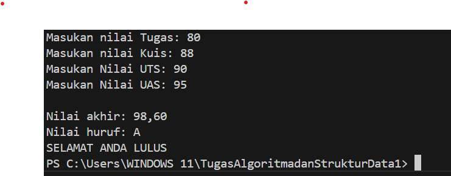
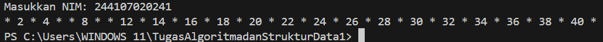
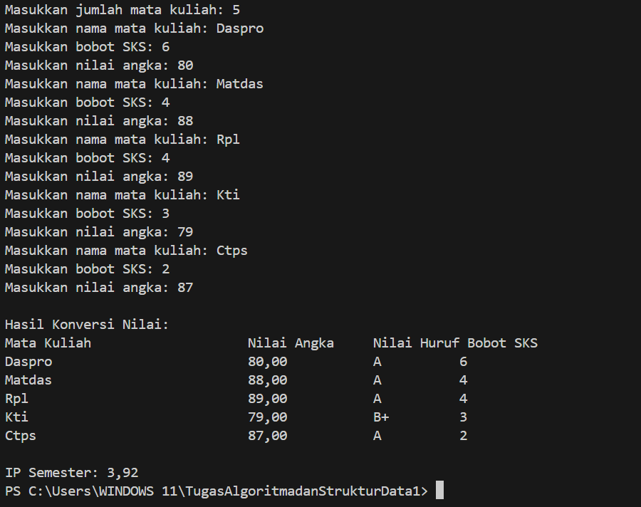

|  | Algorithm and Data Structure |
|--|--|
| NIM |  244107020241|
| Nama |  Andy Otani Dipo Yudho |
| Kelas | TI - 1H |
| Repository | [link] (https://github.com/andyotani/TugasAlgoritmadanStrukturData1) |

# Labs #1 Programming Fundamentals Review

## 2.1.1. Selection Solution

The solution is implemented in Pemilihan.java, and below is screenshot of the result.

**Brief explanaton:** There are 4 main step: 
1. Input all grades
2. Validate the input
3. Calculate and convert the final grade
4. Decide the final status

## 2.2.1. Selection Solution
The solution is implemented in Perulangan.java, and below is screenshot of the result.

**Brief explanaton:** There are 4 main step: 
1. 
2. 
3. 

## 2.3.1. Selection Solution
The solution is implemented in Array.java, and below is screenshot of the result.

**Brief explanaton:** There are 4 main step: 
1. 
2. 
3. 

## 2.4.1. Selection Solution
The solution is implemented in Fungsi.java, and below is screenshot of the result.

**Brief explanaton:** There are 4 main step: 
1. 
2. 
3. 

## Assignments

## Tugas 1

## Tugas 2

## Tugas 3
