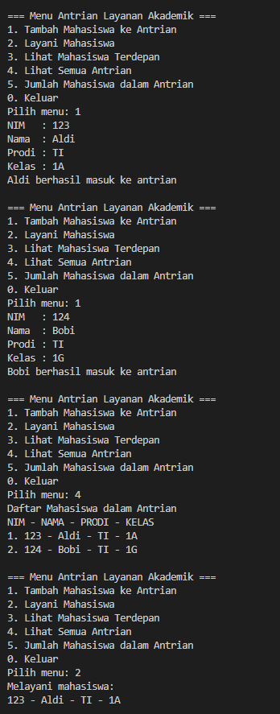
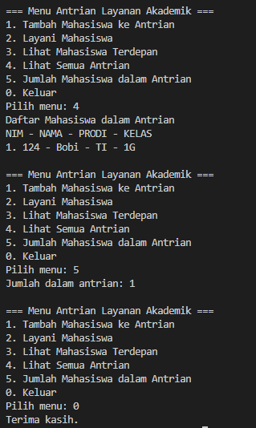
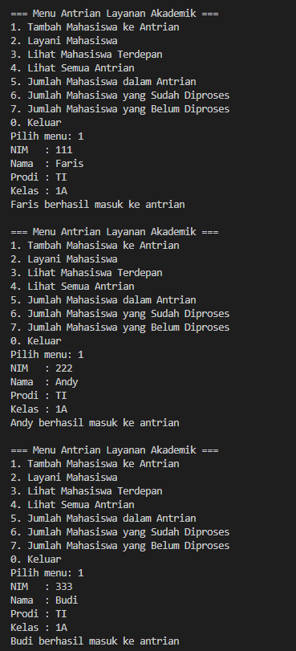
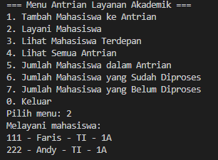
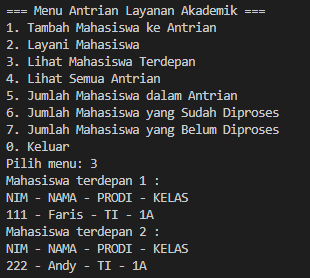
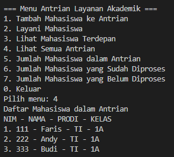
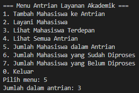
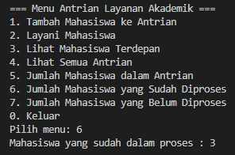
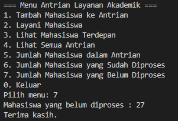

|  | Algorithm and Data Structure |
|--|--|
| NIM |  244107020241|
| Nama |  Andy Otani Dipo Yudho |
| Kelas | TI - 1I |
| Repository | [link] (..) |

# Labs #1 Programming Fundamentals Review
# jOBSHEET 10 - QUEUE - Operasi Dasar Queue

## Percobaan 1
...


**Jawaban Pertanyaan**
1. `front = -1` dan `rear = -1` Ini artinya Queue masih kosong melompong. Tidak ada data di dalamnya, jadi penunjuk awal (front) dan penunjuk akhir (rear) disetel ke posisi yang tidak ada (-1) untuk menandakan kosong.
`size = 0` Ini sesuai dengan kenyataan bahwa jumlah data yang tersimpan di Queue memang nol.

2. Kode ini mengatur posisi rear (ekor Queue atau tempat data baru akan masuk) saat menambahkan data baru. Ini adalah bagian dari cara kerja circular queue (Queue melingkar).
  - `if (rear == max - 1) { rear = 0; }` Jika rear sudah berada di posisi terakhir array `(max - 1)`, rear akan dipindahkan kembali ke posisi 0. Ini bertujuan agar Queue bisa "melingkar" dan menggunakan kembali tempat kosong di awal array yang mungkin sudah ditinggalkan oleh data yang keluar dari front.
  - `else { rear++; }` Jika rear belum di posisi terakhir array, rear hanya digeser maju satu langkah ke posisi berikutnya.
3. Kode ini mengatur posisi front (kepala Queue atau tempat data keluar) setelah satu data dihapus dari Queue. Ini juga bagian dari cara kerja circular queue.
  - `if (front == max -1) { front = 0; }` Jika front sudah berada di posisi terakhir array `(max - 1)`, front akan dipindahkan kembali ke posisi 0. Ini memungkinkan front untuk "melompat" ke awal array jika data berikutnya berada di sana setelah Queue berputar.
  - `else { front++; }` Jika front belum di posisi terakhir array, front hanya digeser maju satu langkah ke posisi berikutnya.
4. Queue adalah struktur data FIFO (First-In, First-Out). Artinya, data yang pertama masuk adalah data yang pertama keluar, dan data ini selalu ditunjuk oleh `front`.
  Mulai dari `front` memastikan bahwa kita mencetak data yang benar-benar ada di dalam Queue saat itu, sesuai urutan masuknya. Jika kita mulai dari `0`, kita mungkin mencetak bagian array yang sebenarnya sudah kosong atau bukan bagian dari Queue saat ini karena data sudah dikeluarkan.
5. Potongan kode tersebut berfungsi untuk menggerakkan indeks `i` ke posisi berikutnya di dalam array secara melingkar (circular).
  - Ketika `i` mencapai akhir array (misalnya `max - 1`), `(i+1)` akan menjadi `max`.
  - Operator modulo `(% max)` akan mengubah `max % max` menjadi `0`. Jadi, `i` akan kembali ke indeks `0`.
  - Ini penting untuk memastikan bahwa seluruh elemen Queue dapat dicetak dengan benar, meskipun mereka "melingkar" di dalam array.
6. Menunjukkan kode
```java
        if (isFull()) {
            System.out.println("Queue sudah penuh");
        } 
```

7. Modifikasi program
```java
        if (isFull()) {
            return;
        } 
```

## Percobaan 2 - Antrian Layanan Akademik
...




**Jawaban Pertanyaan**
1. ``` java
    void lihatAkhir() {
            if (isEmpty()) {
                System.out.println("antrian kosong");
            } else {
                System.out.println("Mahasiswa terakhir : ");
                System.out.println("NIM - NAMA - PRODI - KELAS");
                data[rear].tampilkanData();
            }
        }
      ```     

# Latihan - Tugas
...
### Output


      
        
          
            
              
                

