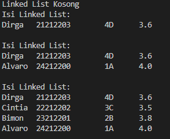
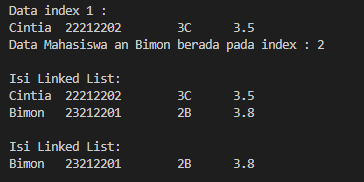
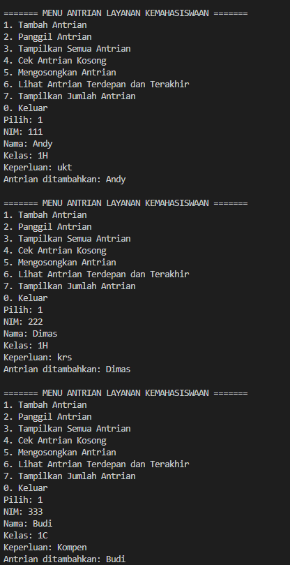
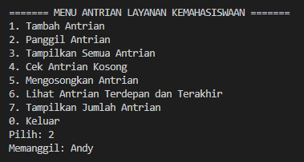
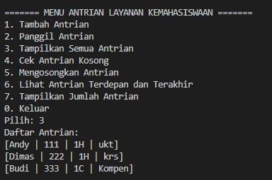
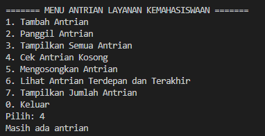
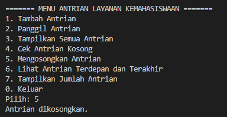
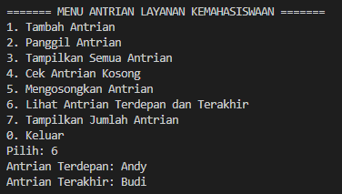
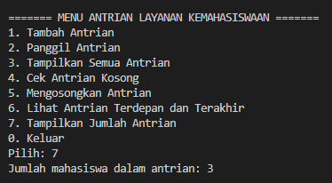

|  | Algorithm and Data Structure |
|--|--|
| NIM |  244107020241|
| Nama |  Andy Otani Dipo Yudho |
| Kelas | TI - 1I |
| Repository | [link] (https://github.com/andyotani/ALSD-sem2/blob/main/Jobsheet11/REPORT.md) |

# Labs #1 Programming Fundamentals Review
# jOBSHEET 11 - LINKED LIST

## Percobaan 1 - Pembuatan Single Linked List
...



**Jawaban Pertanyaan**
1. Hasil compile kode program di baris pertama menghasilkan "Linked List Kosong" karena pada baris tersebut method `print()` dipanggil pada objek `sll` yang baru saja diinisialisasi. Saat `SingleLinkedList04` baru dibuat, `head` dan `tail` masih `null`, sehingga method `isEmpty()` akan mengembalikan `true`. Akibatnya, blok else pada method `print()` dijalankan, mencetak "Linked List Kosong".
2. Variabel `temp` secara umum pada setiap method (khususnya `insertAfter dan insertAt`) digunakan sebagai penunjuk (pointer) untuk menelusuri elemen-elemen dalam `SingleLinkedList04`.
 - Pada method `insertAfter(String key, Mahasiswa04 input)`, `temp` digunakan untuk mencari node yang memiliki `data.nama` yang sesuai dengan `key`. Setelah node ditemukan, `temp` digunakan untuk menyisipkan node baru setelahnya.
 - Pada method `insertAt(int index, Mahasiswa04 input)`, temp digunakan untuk bergerak maju `index - 1` kali dari head sehingga temp akan menunjuk pada node sebelum posisi di mana node baru akan disisipkan.
 3. ```java
        System.out.print("Berapa jumlah data mahasiswa yang ingin ditambahkan? ");
        int jumlah = sc.nextInt();
        sc.nextLine(); 

        for (int i = 0; i < jumlah; i++) {
            System.out.println("\nData Mahasiswa ke-" + (i + 1));
            System.out.print("Nama  : ");
            String nama = sc.nextLine();
            System.out.print("NIM   : ");
            String nim = sc.nextLine();
            System.out.print("Kelas : ");
            String kelas = sc.nextLine();
            System.out.print("IPK   : ");
            double ipk = sc.nextDouble();


            Mahasiswa25 mhs = new Mahasiswa25(nama, nim, kelas, ipk);
            sll.addLast(mhs); 
        }

        System.out.println("\nData Mahasiswa dalam Linked List:");
        sll.print();
    }
    }
     ``` 

## Percobaan 2 - Modifikasi Elemen pada Single Linked List
...



**Jawaban Pertanyaan**
1. Agar tidak menjalankan kode dibawah nya jika sudah terpenuhi kondisi if.
2. ```java 
    temp.next = temp.next.next;
    if (temp.next == null) {
        tail = temp;
    }
    ```
    - `temp.next = temp.next.next;` Baris ini menghapus node yang berada setelah `temp` dengan cara menyambungkan `temp` langsung ke node setelah node yang akan dihapus.
    - `if (temp.next == null) { tail = temp; }` Blok ini memeriksa apakah node yang baru saja dihapus adalah node terakhir di list. Jika ya, maka `tail` (penunjuk ke node terakhir) diperbarui untuk menunjuk ke `temp`.

# Latihan - Tugas

1. **Tambah Antrian**

2. **Panggil Antrian**

3. **Tampilkan Semua Antrian**

4. **Cek Antrian Kosong**

5. **Mengosongkan Antrian**

6. **Lihat Antrian Terdepan dan Terakhir**

7. **Tampilkan Jumlah Antrian**

