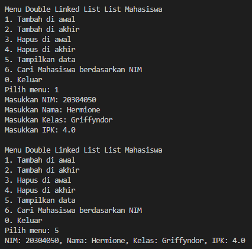
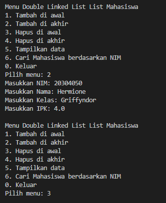

|  | Algorithm and Data Structure |
|--|--|
| NIM |  244107020241|
| Nama |  Andy Otani Dipo Yudho |
| Kelas | TI - 1I |
| Repository | [link] (https://github.com/andyotani/ALSD-sem2/blob/main/Jobsheet12/REPORT.md) |

# Labs #1 Programming Fundamentals Review
# jOBSHEET 11 - Double Linked Lists


## Percobaan 1 
...



**Jawaban Pertanyaan**
1. - `Single Linked List`Tiap node hanya punya satu arah, yaitu ke node berikutnya (next).Tidak bisa mundur.
   - `Double Linked List`Tiap node punya dua arah: ke node berikutnya (next) dan ke node sebelumnya (prev). Bisa maju dan mundur.
2. `next` Menunjuk ke node setelahnya. sedangkan `prev`` Menunjuk ke node sebelumnya. Keduanya dipakai agar data bisa diakses dua arah dalam double linked list.
3. Konstruktor ini digunakan untuk menginisialisasi linked list agar kosong.
  - `head` = null → belum ada node pertama
  - `tail` = null → belum ada node terakhir
4. Jika linked list masih kosong, maka node baru (newNode) akan menjadi node pertama sekaligus terakhir.
  - `head` = newNode → jadi node pertama
  - `tail` = newNode → juga jadi node terakhir
5. Node baru `(newNode)` menjadi node sebelum head lama. Jadi, `head` lama menunjuk balik ke `newNode` lewat `prev`.
6. ```java
    if (isEmpty()) {
    System.out.println("Linked list masih kosong!");
    return;
}
    ```
7. Node setelah `current` akan menunjuk balik ke node baru `(newNode)` lewat `prev`. Ini penting agar koneksi dua arah (prev dan next) tetap benar di double linked list.   
8. ``` java
    switch(pilihan) {
    case 1:
        list.addFirst(...);
        break;
    // Tambahkan ini untuk insertAfter
    case 5:
        list.insertAfter(key, newData);
        break;

    // pilihan ke menu tampilannya
    // System.out.println("5. Tambah data setelah node tertentu");
}
     ```

## Percobaan 2 - Modifikasi Elemen pada Single Linked List
...



**Jawaban Pertanyaan**
1. `head = head.next;` : node pertama dihapus, dan posisi `head` sekarang pindah ke node berikutnya.
   `head.prev = null;` : node baru yang jadi `head` tidak punya node sebelumnya (karena sudah di depan), jadi `prev` diset ke `null`.  

2. ```java
    public void removeFirst() throws Exception {
    if (isEmpty()) {
        throw new Exception("Linked list masih kosong, tidak bisa hapus!");
    } else {
        Mahasiswa04 dataYangDihapus = head.data; // simpan data sebelum dihapus

        if (head == tail) { // hanya ada satu elemen
            head = tail = null;
        } else {
            head = head.next;
            head.prev = null;
        }

        System.out.println("Data sudah berhasil dihapus.");
        System.out.println("Data yang terhapus adalah: " + dataYangDihapus);
    }
}
     ```
# Latihan - Praktikum

1. `fungsi add()`


2. `removeAfter()`


3. `fungsi remove()`


4. `fungsi getFirst()`


5. `fungsi getSize`


