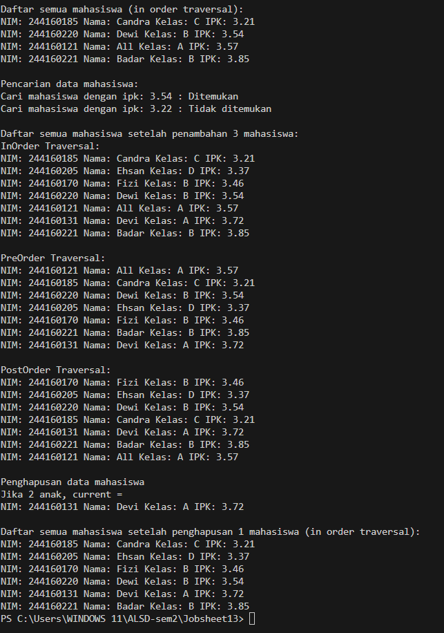

|  | Algorithm and Data Structure |
|--|--|
| NIM |  244107020241|
| Nama |  Andy Otani Dipo Yudho |
| Kelas | TI - 1H |
| Repository | [link] (https://github.com/andyotani/ALSD-sem2/blob/main/Jobsheet13/REPORT.md) |

# Labs #1 Programming Fundamentals Review
# jOBSHEET 13 - Tree


## Percobaan 1 - Implementasi Binary Search Tree menggunakan Linked List
...



**Jawaban Pertanyaan**
1. - BST memiliki sifat terurut: Left child < Parent < Right child
   - Pencarian binary: Pada setiap langkah, kita bisa mengeliminasi setengah subtree (O(log n) dalam BST seimbang)
   - Binary tree biasa tidak memiliki aturan pengurutan, sehingga pencarian harus dilakukan secara linear (O(n))
2. - left: Pointer ke node anak kiri (subtree dengan nilai lebih kecil)
   - right: Pointer ke node anak kanan (subtree dengan nilai lebih besar)
   - Membentuk struktur hierarkis pohon dimana setiap node maksimal memiliki 2 anak
3. a).  root adalah node paling atas/puncak dari pohon
        Sebagai titik awal untuk mengakses seluruh struktur pohon
        Semua operasi (tambah, cari, hapus) dimulai dari root
   b).  null (diinisialisasi dalam constructor: root = null)
        Menandakan pohon masih kosong
4. Node baru langsung ditetapkan sebagai root
``` java
    if (isEmpty()) {
    root = newNode; // Node baru menjadi root
}
```

5. Proses ini mencari posisi kosong yang tepat dengan mempertahankan sifat BST(binary search tree)
``` java
    parent = current; // Menyimpan referensi node parent sebelum bergerak
if (mahasiswa.ipk < current.mahasiswa.ipk) { // Jika IPK lebih kecil
    current = current.left; // Pindah ke left child
    if (current == null) { // Jika tidak ada left child
        parent.left = newNode; // Tambahkan node baru sebagai left child
        return;
    }
} else { // Jika IPK lebih besar/sama
    current = current.right; // Pindah ke right child
    if (current == null) { // Jika tidak ada right child
        parent.right = newNode; // Tambahkan node baru sebagai right child
        return;
    }
}
``` 
6. Proses delete()
    - Temukan node yang akan dihapus (current)
    - Cari in-order successor (node terkecil di subtree kanan) menggunakan getSuccessor()
    - Ganti nilai current dengan nilai successor
    - Hapus successor asli
Peran getSuccessor():
``` java
    Node04 getSuccessor(Node04 del) {
    Node04 successor = del.right; // Mulai dari subtree kanan
    while (successor.left != null) { // Cari nilai terkecil
        successor = successor.left;
    }
    return successor; // Kembalikan node penerus
}
``` 
Successor menjamin sifat BST tetap terjaga karena:
 - Lebih besar dari semua node di subtree kiri
 - Lebih kecil dari node lain di subtree kanan

## Percobaan 2 - Implementasi Binary Tree dengan Array
...


**Jawaban Pertanyaan**
1.  
2. 
3. 
4. 
5. 
6. 

# Tugas - Praktikum

1. 
2. 
3. 
