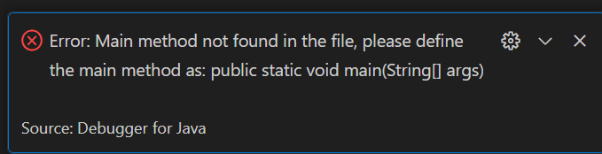
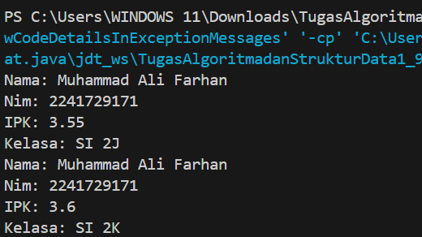
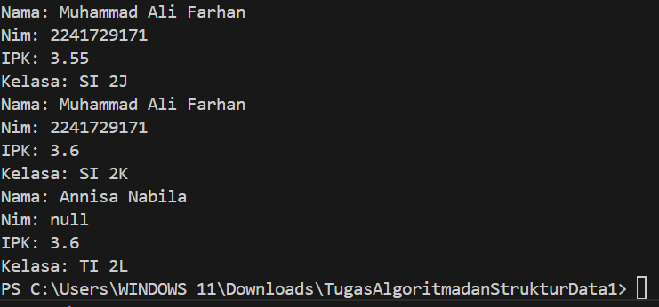
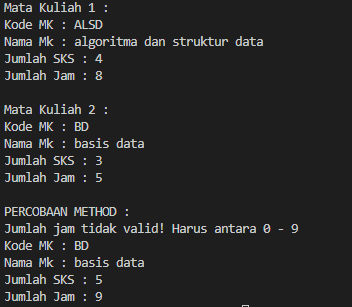
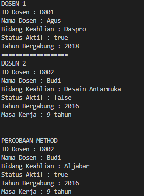

|  | Algorithm and Data Structure |
|--|--|
| NIM |  244107020241|
| Nama |  Andy Otani Dipo Yudho |
| Kelas | TI - 1I |
| Repository | [link] (https://github.com/andyotani/ALSD/blob/main/Jobsheet2/Reportt.md) |

# Labs #1 Programming Fundamentals Review
# jOBSHEET 2 - Object

## Percobaan 1 - Deklarasi Class, Atribut dan Method

...



**Jawaban Pertanyaan**
1. Atribut : Data yang dimiliki oleh objek. Method : Tindakan yang dapat dilakukan oleh objek
2. Ada 4 yaitu : nama, nim, kelas, ipk. 
3. Ada 4 yaitu : tampilkanInformasi(), ubahKelas(String KelasBaru), updateIpk(double ipkBaru), nilaiKinerja().
4. modifikasi method updateIpk() agar hanya menerima nilai IPK dalam rentang 0.0 - 4.0:
    ```void updateIpk(double ipkBaru) {
    if (ipkBaru >= 0.0 && ipkBaru <= 4.0) {
        ipk = ipkBaru;
    } else {
        System.out.println("IPK tidak valid. Harus antara 0.0 dan 4.0");
    }
}
```     ``

5. Method nilaiKinerja() berfungsi untuk mengevaluasi kinerja mahasiswa berdasarkan nilai IPK yang dimilikinya.
Kriteria Evaluasinya: 
IPK ≥ 3.5 → "Kinerja Sangat Baik"
IPK ≥ 3.0 dan < 3.5 → "Kinerja Baik"
IPK ≥ 2.0 dan < 3.0 → "Kinerja Cukup"
IPK < 2.0 → "Kinerja Kurang"
Method ini mengembalikan nilai String, yang berisi evaluasi kinerja mahasiswa berdasarkan IPK yang dimiliki.


## Percobaan 2 - Instansiasi Object, serta Mengakses Atribut dan Method

...



**Jawaban Pertanyaan**
1.  **  public Mahasiswa04(String nm, String nim, double ipk, String kls) {
    this.nama = nm;
    nim = nim;
    this.ipk = ipk;
    this.kelas = kls;
}
**
Fungsi konstruktor ini:

Menerima parameter nama, nim, ipk, dan kelas untuk langsung menginisialisasi atribut objek Mahasiswa04.
Menggunakan this untuk membedakan atribut kelas dan parameter dengan nama yang sama
2. - new Mahasiswa04(...) memanggil konstruktor berparameter untuk membuat objek mhs2 dengan atribut yang langsung diinisialisasi:
nama = "Annisa Nabila"
nim = "2141720160"
ipk = 3.25
kelas = "TI 2L"
- Setelah objek dibuat, method updateIpk(3.60); dan tampilkanInformasi(); dipanggil untuk memperbarui IPK dan menampilkan informasi mahasiswa. 

3. Jika kita menghapus konstruktor default: public Mahasiswa04() { }
- Java secara otomatis menyediakan konstruktor default hanya jika tidak ada konstruktor lain.
- Namun, karena kita sudah menuliskan konstruktor berparameter, Java tidak lagi membuat konstruktor default.
- Sehingga ketika baris new Mahasiswa04(); dipanggil, Java tidak menemukan konstruktor tanpa parameter, dan program gagal dikompilasi.


##  Percobaan 3 - Membuat Konstruktor

...



**Jawaban Pertanyaan**
1. ``
    public Mahasiswa04(String nm, String nim, double ipk, String kls) {
    this.nama = nm;
    this.nim = nim;
    this.ipk = ipk;
    this.kelas = kls;
}

``
    Konstruktor ini digunakan untuk menginisialisasi objek Mahasiswa04 dengan nilai tertentu saat objek dibuat.
2. - Membuat objek mhs2 dari kelas Mahasiswa04.
   - Menggunakan konstruktor berparameter untuk langsung mengisi atribut nama, nim, ipk, dan kelas.
   - Nilai "Annisa Nabila", "2141720160", 3.25, dan "TI 2L" langsung diberikan ke dalam atribut nama, nim, ipk, dan kelas saat objek mhs2 dibuat.
3. maka akan terjadi eror 
   Karena tidak ada konstruktor default, Java tidak akan secara otomatis membuatnya jika ada konstruktor lain yang dideklarasikan.
   Oleh karena itu, ketika kita mencoba membuat objek mhs1 dengan konstruktor tanpa parameter, program akan gagal dikompilasi karena Java tidak dapat menemukan konstruktor yang cocok.    
4. Tidak, method dalam class Mahasiswa tidak harus diakses secara berurutan setelah instansiasi objek.
    Alasannya:

    Pemanggilan method bersifat independen, sehingga bisa dipanggil kapan saja sesuai kebutuhan.
    Eksekusi method tergantung pada urutan pemanggilan dalam main(), bukan urutan deklarasi di dalam class.
    Namun, ada pengecualian jika method saling bergantung, misalnya:
    Method tampilkanInformasi() akan mencetak data mahasiswa, sehingga harus dipanggil setelah atribut diinisialisasi.
    Jika updateIpk() dipanggil setelah tampilkanInformasi(), maka IPK yang ditampilkan tidak akan diperbarui.
5.  ``
    Mahasiswa04 mhsAndyO = new Mahasiswa04("Andy O", "244107020241", 3.75, "TI 1H");

``
mhsRizkyAndika adalah nama objek.
"Andy O" adalah nama mahasiswa.
"2241729999" adalah NIM.
3.75 adalah IPK.
"TI 2M" adalah kelas.
Jika ada nama mahasiswa lain, cukup ganti "Andy O" dengan nama tersebut.


# Latihan Praktikum
## 1. MataKuliah
...



### Penjelasan 
1. **Mendeklarasikan variabel untuk menyimpan data mata kuliah:**  
   Kelas `MataKuliah04` memiliki atribut seperti `kodeMk`, `nama`, `sks`, dan `jumlahJam` untuk menyimpan informasi tentang mata kuliah.

2. **Menginisialisasi objek mata kuliah:**  
   Objek `mk1` dibuat menggunakan constructor default, lalu atributnya diisi secara manual. Objek `mk2` dibuat menggunakan constructor dengan parameter untuk langsung menginisialisasi data.

3. **Menampilkan informasi mata kuliah:**  
   Metode `tampilkanInformasi()` digunakan untuk mencetak data mata kuliah, seperti kode mata kuliah, nama, jumlah SKS, dan jumlah jam.

4. **Mengubah data mata kuliah:**  
- Metode `ubahSks(int sksBaru)` digunakan untuk mengubah jumlah SKS mata kuliah.  
- Metode `tambahJam(int jam)` menambahkan jumlah jam mata kuliah.  
- Metode `kurangiJam(int jam)` mengurangi jumlah jam, dengan validasi agar pengurangan tidak melebihi jumlah jam yang tersedia.

5. **Menampilkan hasil perubahan:**  
   Setelah memanggil metode untuk mengubah data (`ubahSks`, `tambahJam`, dan `kurangiJam`), informasi mata kuliah diperbarui dan ditampilkan kembali dengan metode `tampilkanInformasi()`.

## 2. Dosen
...



### Penjelasan 
1. **Mendeklarasikan variabel untuk menyimpan data dosen:**  
   Kelas `Dosen04` memiliki atribut seperti `idDosen`, `nama`, `bidangKeahlian`, `statusAktif`, dan `tahunBergabung`. Atribut ini digunakan untuk menyimpan informasi tentang dosen.

2. **Menginisialisasi objek dosen:**  
   Objek `dsn1` dibuat menggunakan constructor dengan parameter, sedangkan `dsn2` dibuat menggunakan constructor default lalu nilai atributnya diatur secara manual.

3. **Menampilkan informasi dosen:**  
   Metode `tampilkanInformasi()` digunakan untuk mencetak detail dosen, seperti ID, nama, bidang keahlian, status aktif, dan tahun bergabung.

4. **Mengubah data dosen:**  
   Objek `dsn2` mengalami perubahan status aktif menggunakan metode `setStatusAktif()` dan perubahan bidang keahlian menggunakan metode `ubahKeahlian()`.

5. **Menghitung masa kerja dan menampilkan hasil:**  
   Metode `hitungMasaKerja(int tahunSkrg)` digunakan untuk menghitung selisih antara tahun saat ini (2025) dengan tahun bergabung. Hasilnya ditampilkan bersama informasi terbaru setelah perubahan atribut.

6. **Program ini dibuat untuk menyimpan dan menampilkan data dosen, seperti nama, NIP, NIDN, dan jabatan akademik. Data dosen dimasukkan melalui konstruktor saat objek dibuat, kemudian ditampilkan ke layar menggunakan method tampilData(). Seluruh proses dimulai dari method main() yang ada di kelas DosenMain04. Program ini membantu menampilkan informasi dosen secara lengkap dan terstruktur menggunakan konsep objek dan method dalam Java.**
