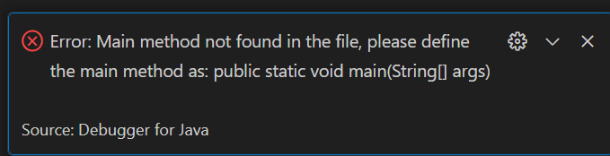
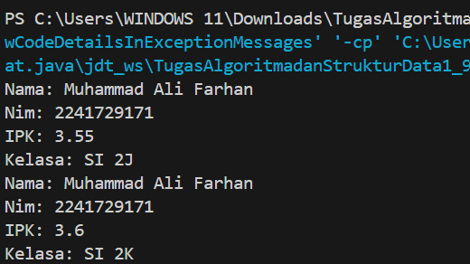
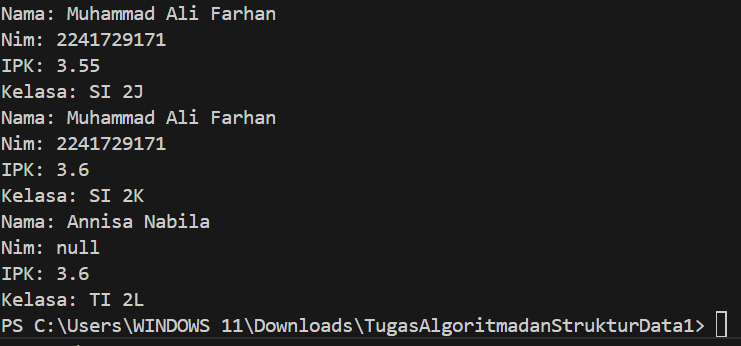

|  | Algorithm and Data Structure |
|--|--|
| NIM |  244107020241|
| Nama |  Andy Otani Dipo Yudho |
| Kelas | TI - 1I |
| Repository | [link] (https://github.com/andyotani/ALSD/blob/main/Jobsheet2/Reportt.md) |

# Labs #1 Programming Fundamentals Review
# jOBSHEET 2

## Percobaan 1

...



**Jawaban Pertanyaan**
1. Atribut : Data yang dimiliki oleh objek. Method : Tindakan yang dapat dilakukan oleh objek
2. Ada 4 yaitu : nama, nim, kelas, ipk. 
3. Ada 4 yaitu : tampilkanInformasi(), ubahKelas(String KelasBaru), updateIpk(double ipkBaru), nilaiKinerja().
4. modifikasi method updateIpk() agar hanya menerima nilai IPK dalam rentang 0.0 - 4.0:
    ```void updateIpk(double ipkBaru) {
    if (ipkBaru >= 0.0 && ipkBaru <= 4.0) {
        ipk = ipkBaru;
    } else {
        System.out.println("IPK tidak valid. Harus antara 0.0 dan 4.0");
    }
}
```     ``

5. Method nilaiKinerja() berfungsi untuk mengevaluasi kinerja mahasiswa berdasarkan nilai IPK yang dimilikinya.
Kriteria Evaluasinya: 
IPK ≥ 3.5 → "Kinerja Sangat Baik"
IPK ≥ 3.0 dan < 3.5 → "Kinerja Baik"
IPK ≥ 2.0 dan < 3.0 → "Kinerja Cukup"
IPK < 2.0 → "Kinerja Kurang"
Method ini mengembalikan nilai String, yang berisi evaluasi kinerja mahasiswa berdasarkan IPK yang dimiliki.


## Percobaan 2

...



**Jawaban Pertanyaan**
1.  **  public Mahasiswa04(String nm, String nim, double ipk, String kls) {
    this.nama = nm;
    nim = nim;
    this.ipk = ipk;
    this.kelas = kls;
}
**
Fungsi konstruktor ini:

Menerima parameter nama, nim, ipk, dan kelas untuk langsung menginisialisasi atribut objek Mahasiswa04.
Menggunakan this untuk membedakan atribut kelas dan parameter dengan nama yang sama
2. - new Mahasiswa04(...) memanggil konstruktor berparameter untuk membuat objek mhs2 dengan atribut yang langsung diinisialisasi:

nama = "Annisa Nabila"
nim = "2141720160"
ipk = 3.25
kelas = "TI 2L"
- Setelah objek dibuat, method updateIpk(3.60); dan tampilkanInformasi(); dipanggil untuk memperbarui IPK dan menampilkan informasi mahasiswa. 
3. Jika kita menghapus konstruktor default: public Mahasiswa04() { }
- Java secara otomatis menyediakan konstruktor default hanya jika tidak ada konstruktor lain.
- Namun, karena kita sudah menuliskan konstruktor berparameter, Java tidak lagi membuat konstruktor default.
- Sehingga ketika baris new Mahasiswa04(); dipanggil, Java tidak menemukan konstruktor tanpa parameter, dan program gagal dikompilasi.


##  Percobaan 3

...



**Jawaban Pertanyaan**
1. 
2. 
3. 
4. 
5. 


# Latihan
## 1. MataKuliah
...


## 2. Dosen
...

