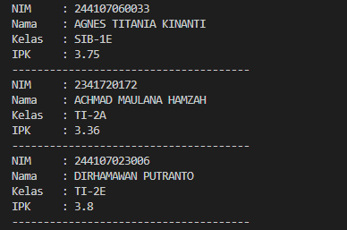
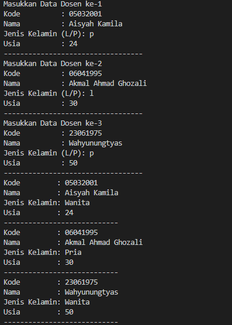

|  | Algorithm and Data Structure |
|--|--|
| NIM |  244107020241|
| Nama |  Andy Otani Dipo Yudho |
| Kelas | TI - 1I |
| Repository | [link] (https://github.com/andyotani/ALSD/tree/main/Jobsheet3) |

# Labs #1 Programming Fundamentals Review
# jOBSHEET 3

## Percobaan 1

...



**Jawaban Pertanyaan**
1. Tidak harus. Suatu class yang digunakan dalam array of objects minimal harus memiliki atribut untuk menyimpan data. Namun, memiliki method bersifat opsional. Method diperlukan  jika kita ingin memberikan fungsi tambahan seperti menampilkan data, melakukan perhitungan, atau validasi.
2. Kode ini mendeklarasikan sebuah array bernama arrayOfMahasiswa yang dapat menampung 3 objek dari class Mahasiswa. Namun, array ini belum berisi objek secara langsung, hanya menyiapkan tempat untuk tiga objek Mahasiswa.
3. Class Mahasiswa04 tidak memiliki konstruktor eksplisit yang didefinisikan oleh programmer. Namun, Java secara otomatis menyediakan konstruktor default jika tidak ada konstruktor yang didefinisikan. Konstruktor default ini hanya menginisialisasi objek tanpa melakukan apa pun.
4. - Membuat objek Mahasiswa baru pada indeks 0 dalam array.
- Mengisi atribut objek tersebut dengan data seperti NIM, Nama, Kelas, dan IPK.
- Setelah dieksekusi, objek Mahasiswa pertama dalam array akan berisi data mahasiswa dengan nama "AGNES TITANIA KINANTI".
5. Class Mahasiswa04 hanya digunakan untuk mendefinisikan atribut dan struktur data mahasiswa.
Class MahasiswaDemo04 bertindak sebagai driver class yang menjalankan program utama (main) untuk membuat array objek Mahasiswa04, mengisi data, dan menampilkannya.
Pemisahan ini memudahkan pemeliharaan kode serta mengikuti konsep pemrograman berorientasi objek (OOP) yang baik.


## Percobaan 2

...


**Jawaban Pertanyaan**
1. Method ini bertujuan untuk mencetak informasi mahasiswa tanpa perlu memanggil System.out.println berulang kali di main.
2. Kode berikut menyebabkan error karena meskipun array myArrayOfMahasiswa telah dideklarasikan dengan new Mahasiswa[3], elemen-elemen dalam array tersebut belum diinisialisasi sebagai objek Mahasiswa. 
```
Mahasiswa[] myArrayOfMahasiswa = new Mahasiswa[3];

```
Kode ini hanya membuat array yang dapat menampung 3 objek Mahasiswa, tetapi belum membuat objek Mahasiswa itu sendiri. Jadi, semua elemen array masih null.


##  Percobaan 3

...


**Jawaban Pertanyaan**
1. Ya, suatu class dapat memiliki lebih dari satu constructor. Ini disebut constructor overloading, di mana sebuah class memiliki beberapa constructor dengan parameter yang berbeda.
    ``
    public class Matakuliah04 {
    String kode, nama;
    int sks, jumlahJam;

    // Constructor 1 (tanpa parameter)
    public Matakuliah04() {
        this.kode = "";
        this.nama = "";
        this.sks = 0;
        this.jumlahJam = 0;
    }

    // Constructor 2 (dengan parameter)
    public Matakuliah04(String kode, String nama, int sks, int jumlahJam) {
        this.kode = kode;
        this.nama = nama;
        this.sks = sks;
        this.jumlahJam = jumlahJam;
    }
}

    ``
2. Method tambahData() telah ditambahkan di dalam class Matakuliah04 untuk menerima input dari user.
3. Method cetakInfo() telah ditambahkan untuk mencetak informasi mata kuliah
4. 


# Latihan
## 1. 
...



## 2. 
...

