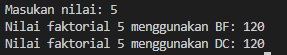
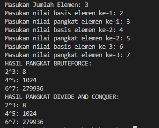
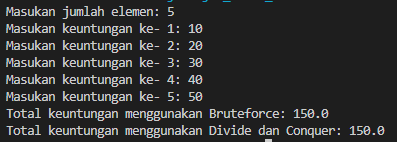
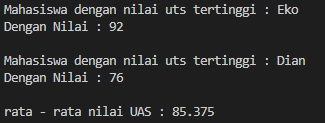

|  | Algorithm and Data Structure |
|--|--|
| NIM |  244107020241|
| Nama |  Andy Otani Dipo Yudho |
| Kelas | TI - 1I |
| Repository | [link] (https://github.com/andyotani/ALSD-sem2/blob/main/Jobsheet4/REPORT.md) |

# Labs #1 Programming Fundamentals Review
# jOBSHEET 5 - BRUTE FORCE DAN DIVIDE CONQUER

## Percobaan 1 - Menghitung Nilai Faktorial dengan Algoritma Brute Force dan Divide and Conquer

...



**Jawaban Pertanyaan**
1. Perbedaan if dan else di factorialDC() (metode rekursif)
if (n == 1): Ini adalah "titik berhenti" atau kondisi dasar. Kalau n sudah 1, langsung kembalikan 1. Ini penting agar perhitungannya tidak jalan terus tanpa henti.
else: Ini adalah "langkah maju" untuk memecahkan masalah. Kalau n bukan 1, hitung n dikalikan dengan faktorial dari (n-1). Jadi, dia memanggil dirinya sendiri lagi dengan angka yang lebih kecil, sampai akhirnya mencapai n=1.

2. Ya, Kita bisa pakai while atau do-while. 
``` java
 // brute force menggunakan while loop
int factorialBF(int n){
    int facto = 1;
    int i = 1; // Inisialisasi penghitung perulangan
    while(i <= n){ // Kondisi perulangan
        facto = facto * i;
        i++; // Tambahkan penghitung perulangan
    }
    return facto;
}
// brute force menggunakan do-while loop (assuming n >= 1 for typical factorial)
int factorialBF(int n){
    int facto = 1;
    if (n == 0) return 1; // Tangani 0! = 1 secara eksplisit jika perlu
    int i = 1;
    do {
        facto = facto * i;
        i++;
    } while (i <= n);
    return facto;
}
``` 

3. **`fakto *= i;` (atau `facto = facto * i;`)**
    Ini ada di metode yang pakai perulangan `(factorialBF())`. Artinya, facto yang sekarang dikalikan dengan i (angka dari 1 sampai n), lalu hasilnya disimpan kembali ke facto. Ini dilakukan berulang-ulang sampai semua angka dikalikan.
 **`int fakto = n * faktorialDC(n-1);`** 
    Ini ada di metode rekursif `(factorialDC())`. Artinya, untuk menghitung faktorial n, kita harus menghitung n dikalikan dengan hasil dari faktorial (n-1). Jadi, baris ini meminta dirinya sendiri untuk menghitung faktorial yang lebih kecil terlebih dahulu.
4. **`factorialBF()`** 
Mengalikan angka satu per satu dari 1 sampai n secara berurutan. Seperti menghitung 1 * 2 * 3 * ... * n.
Contoh: Untuk 5!, dia hitung 1 * 2 = 2, lalu 2 * 3 = 6, lalu 6 * 4 = 24, lalu 24 * 5 = 120.
**`factorialDC() (Cara Rekursif/Divide and Conquer)`** 
Memecah masalah besar jadi masalah kecil yang sama. Untuk menghitung n!, dia bilang "hitung dulu (n-1)!, nanti hasilnya saya kalikan dengan n". Terus begitu sampai ketemu 1! yang hasilnya sudah tahu (yaitu 1).
Contoh: Untuk 5!, dia bilang "5 * (4!)". Lalu, untuk 4!, dia bilang "4 * (3!)", terus sampai "2 * (1!)". Nah, karena 1! itu 1, dia mulai kembali: 2 * 1 = 2, lalu 3 * 2 = 6, lalu 4 * 6 = 24, lalu 5 * 24 = 120.
Singkatnya, `factorialBF()` itu maju terus menghitungnya, sedangkan `factorialDC()` itu mundur dulu ke masalah yang lebih kecil, baru setelah itu maju lagi mengalikan hasilnya.


## Percobaan 2 - Menghitung Hasil Pangkat dengan Algoritma Brute Force dan Divide and Conquer

...



**Jawaban Pertanyaan**
1. **pangkatBF()** Ini menghitung pangkat dengan cara mengalikan berulang. Misalnya, kalau 2 pangkat 3, dia hitung 2 * 2 * 2. Ini cara yang paling mudah dipahami, tapi bisa lambat kalau pangkatnya besar sekali.
pangkatDC() (Divide and Conquer/Rekursif): Ini menghitung pangkat dengan cara memecah masalah. Misalnya, kalau 2 pangkat 8, dia pecah jadi (2 pangkat 4) dikali (2 pangkat 4). Kalau 2 pangkat 7, dia pecah jadi (2 pangkat 3) dikali (2 pangkat 3) dikali 2. Cara ini lebih cepat untuk pangkat yang besar.
2. Ya, ada
Tahap menggabungkan itu terjadi saat hasil dari perhitungan pangkat yang lebih kecil (misalnya hasil dari 2 pangkat 4) dipakai untuk menghitung pangkat yang lebih besar (2 pangkat 8).
Di bagian return (pangkatDC(a, n/2)* pangkatDC(a, n/2)*a);: Ini menggabungkan hasil pangkatDC(a, n/2) yang dihitung dua kali, lalu dikalikan lagi dengan a.
Di bagian return (pangkatDC(a, n/2)* pangkatDC(a, n/2));: Ini menggabungkan hasil pangkatDC(a, n/2) yang dihitung dua kali dengan cara mengalikannya. Jadi, hasil dari bagian yang lebih kecil dikalikan bersama untuk mendapatkan jawaban akhir.
3. Dengan adanya parameter (int a, int n), method ini bisa menghitung pangkat untuk angka apa saja, tidak hanya angka yang sudah disimpan di dalam objek kelas Pangkat. Ini membuat methodnya lebih fleksibel. Kalau tanpa parameter, method ini akan langsung pakai nilai nilai dan pangkat yang sudah disimpan di dalam objeknya.
```java
public class Pangkat{
    int nilai, pangkat;

    Pangkat(int n, int p){
        nilai = n;
        pangkat = p;
    }

    // Method pangkatBF() tanpa parameter, pakai atribut kelas
    int pangkatBF(){ // Tidak ada a, tidak ada n di sini
        int hasil = 1;
        for(int i = 0; i < pangkat; i++){ // Pakai 'pangkat' dari kelas
            hasil = hasil * nilai; // Pakai 'nilai' dari kelas
        }
        return hasil;
    }

    // ... (method pangkatDC tetap sama seperti sebelumnya)
    // int pangkatDC(int a, int n){...}
}
```
Dengan ini, saat Anda panggil objekPangkat.pangkatBF(), dia akan otomatis menggunakan objekPangkat.nilai dan objekPangkat.pangkat.
4. **`pangkatBF()`** Ini seperti menghitung 2^3 dengan 2 * 2 * 2. Dia kerjanya langsung dan berulang dari awal sampai akhir.
**`pangkatDC()`** Ini seperti menghitung 2^8 dengan (2^4) * (2^4). Dia kerjanya memecah masalah besar jadi lebih kecil, lalu hasil dari bagian kecil itu digabungkan. Cara ini lebih efisien (cepat) untuk pangkat yang angkanya besar.


##  Percobaan 3 - Menghitung Sum Array dengan Algoritma Brute Force dan Divide and Conquer

...



**Jawaban Pertanyaan**
1. Variabel mid dibutuhkan pada method `totalDC()` karena ini adalah inti dari algoritma Divide and Conquer. mid digunakan untuk membagi array (atau data) menjadi dua bagian yang lebih kecil dan setara. Pembagian ini memungkinkan masalah besar untuk dipecah menjadi sub-masalah yang lebih mudah diselesaikan secara rekursif. Tanpa mid, pembagian tidak bisa dilakukan.
2. Statement ini dilakukan untuk memecah masalah besar menjadi dua masalah kecil yang sama. lsum menghitung total keuntungan di bagian kiri array, dan rsum menghitung total keuntungan di bagian kanan array. Ini adalah bagian dari strategi "Divide" (membagi) dalam Divide and Conquer.
3. `return lsum+rsum;`
Penjumlahan ini diperlukan karena ini adalah langkah "Combine" (menggabungkan). Setelah kita mendapatkan total keuntungan dari bagian kiri (lsum) dan bagian kanan (rsum), kita perlu menjumlahkan keduanya untuk mendapatkan total keuntungan keseluruhan dari bagian array yang sedang diproses.
4. Base case (kondisi berhenti) dari totalDC() adalah saat l == r. Artinya, ketika bagian array yang sedang dihitung hanya memiliki satu elemen. Pada titik ini, tidak perlu dipecah lagi, cukup kembalikan nilai elemen tunggal tersebut.
5. Cara kerja totalDC() adalah sebagai berikut:
- Pecah (Divide): Pertama, dia memecah array (daftar keuntungan) menjadi dua bagian yang lebih kecil secara terus-menerus. Pemecahan ini dilakukan sampai setiap bagian hanya memiliki satu elemen saja.
- Selesaikan (Conquer): Ketika setiap bagian sudah menjadi satu elemen, dia langsung mengembalikan nilai elemen tersebut (karena totalnya ya elemen itu sendiri). Ini adalah "solusi" untuk masalah terkecil.
- Gabungkan (Combine): Setelah itu, dia mulai menggabungkan hasil-hasil dari bagian-bagian kecil itu dengan cara menjumlahkannya kembali. Proses penggabungan ini terus berlanjut sampai semua bagian digabungkan dan kita mendapatkan total keuntungan dari seluruh array awal.
Jadi, totalDC() itu seperti memecah tugas besar jadi tugas-tugas kecil, menyelesaikan tugas kecil itu, lalu menggabungkan semua hasilnya.


# Latihan
## 1. 
...


**Penjelasan**
1. **Nilau UTS tertinggi tertinggi**
    memecah daftar mahasiswa jadi dua bagian kecil, terus dipecah lagi, sampai tiap bagian cuma ada satu mahasiswa. Lalu, dia membandingkan nilai UTS mahasiswa di bagian kiri dan kanan, ambil yang paling tinggi. Hasil yang paling tinggi itu dibawa ke atas lagi (digabungkan) sampai akhirnya ketemu nilai UTS tertinggi dari seluruh mahasiswa.
2. **Nilai UTS terendah**
    Prosesnya mirip dengan mencari yang tertinggi, daftar mahasiswa dipecah-pecah sampai satu per satu. Bedanya, saat digabungkan kembali, dia membandingkan dan memilih nilai UTS yang paling rendah.
3. **Rata-rata nilai UAS** 
    mengambil satu per satu nilai UAS dari semua mahasiswa. Semua nilai UAS itu dijumlahkan. Setelah semua dijumlahkan, totalnya dibagi dengan berapa banyak mahasiswanya