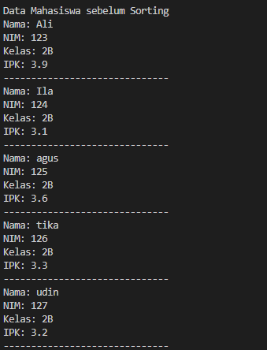
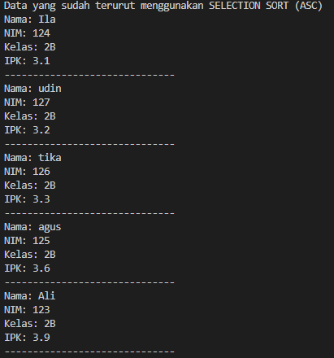

|  | Algorithm and Data Structure |
|--|--|
| NIM |  244107020241|
| Nama |  Andy Otani Dipo Yudho |
| Kelas | TI - 1I |
| Repository | [link] (https://github.com/andyotani/ALSD-sem2/blob/main/Jobsheet5/REPORT.md) |

# Labs #1 Programming Fundamentals Review
# jOBSHEET 6 - SORTING

## 5.2 Praktikum 1 - Mengimplementasikan Sorting menggunakan object

**a). SORTING – BUBBLE SORT**
**b). SORTING – SELECTION SORT**
**c). SORTING – INSERTION SORT**


**Jawaban Pertanyaan**
1. Kode ini ada di dalam metode `bubbleSort()`. Fungsinya adalah untuk membandingkan dua angka yang bersebelahan. Jika angka yang di kiri `(data[j-1])` lebih besar dari angka yang di kanan `(data[j])`, maka kedua angka itu akan ditukar posisinya. Ini tujuannya agar angka yang lebih besar selalu "bergeser" ke kanan, seperti gelembung yang naik ke permukaan.
2. Bagian kode yang mencari nilai paling kecil ada di dalam metode `SelectionSort()`
```java
int min=i; // Anggap angka di posisi 'i' saat ini adalah yang terkecil
for (int j=i+1; j<jumData; j++){
    if(data[j]<data[min]){ // Kalau ada angka lain (data[j]) yang lebih kecil
        min=j; // Ingat posisi (indeks) angka yang lebih kecil itu
    }
}
```
3. Kondisi ini ada di dalam metode `insertionSort()`. Ini adalah dua syarat agar perulangan while terus berjalan:

- `j>= 0` Pastikan kita masih berada di dalam batas array (tidak keluar dari array ke arah kiri).
- `data[j]>temp` Pastikan angka yang sedang kita lihat (data[j]) lebih besar dari angka yang ingin kita sisipkan (temp).
Jadi, while ini akan terus berjalan selama kita belum mencapai awal array dan angka yang kita lihat lebih besar dari angka yang mau kita sisipkan.
4. Tujuannya adalah untuk menggeser angka. Saat kita ingin menyisipkan sebuah angka ke tempat yang benar, kita mungkin perlu membuat "ruang" untuknya. Baris kode ini memindahkan angka yang ada di posisi j ke posisi j+1 (satu langkah ke kanan).


## 5.3 Praktikum 2- Sorting Menggunakan Array of Object

### 5.3.1 Langkah Praktikum 2 - Mengurutkan Data Mahasiswa Berdasarkan IPK (Bubble Sort)
...


**Jawaban Pertanyaan**
1.  a) Karena kalau ada 50 data, kita cuma perlu melakukan proses pengurutan (pass) sebanyak 49 kali. Setelah 49 kali pengurutan, data yang terakhir pasti sudah di tempat yang benar.
    b) Setiap kali perulangan `i` selesai (artinya satu "pass" selesai), satu data terbesar sudah berpindah ke posisi paling kanan. Jadi, pada pass berikutnya, kita tidak perlu memeriksa lagi data yang sudah di kanan itu. Angka `-i` ini mengurangi area pencarian `j` sehingga lebih efisien.
    c)  Perulangan i akan berjalan 49 kali (dari 0 sampai 48).
        Akan ada 49 tahap pengurutan (pass) yang dilakukan oleh bubble sort.
2. Modifikasi Program
```java
        for (int i = 0; i < 5; i++) {
            System.out.print("Masukkan NIM : ");
            String nim = sc.next();
            System.out.print("Masukkan Nama : ");
            String nama = sc.next();
            System.out.print("Masukkan Kelas : ");
            String kelas = sc.next();
            System.out.print("Masukkan IPK : ");
            double ipk = sc.nextDouble();
            Mahasiswa mhs = new Mahasiswa(nim, nama, kelas, ipk);
            list.tambah(mhs);
            System.out.println();
        }
```
### 5.3.5 Mengurutkan Data Mahasiswa Berdasarkan IPK (Selection Sort)





**Jawaban Pertanyaan**
1. ``` java
    int idxMin = i;
    for (int j = i + 1; j < listMhs.length; j++) {
        if (listMhs[j].ipk < listMhs[idxMin].ipk) {
            idxMin = j;
        }
    } 
    ```

    Bagian kode ini digunakan untuk mencari indeks elemen dengan nilai IPK terkecil di antara elemen-elemen yang belum diurutkan.
    `idxMin = i;`
    Menyimpan indeks minimum saat ini, awalnya diasumsikan bahwa elemen ke-i adalah yang terkecil.
    `for (int j = i + 1; j < listMhs.length; j++)`
    Melakukan iterasi ke elemen-elemen setelah indeks i.
    `if (listMhs[j].ipk < listMhs[idxMin].ipk)`
    Mengecek apakah ada elemen lain dengan ipk yang lebih kecil dari elemen pada idxMin.
    `idxMin = j;`
    Jika ditemukan ipk yang lebih kecil, idxMin di-update ke indeks tersebut.


### 5.4 Mengurutkan Data Mahasiswa Berdasarkan IPK Menggunakan Insertion Sort


**Jawaban Pertanyaan**
1. Insertion Sort Descending

```java
    void insertionSortDescending() {
        for (int i = 1; i < listMhs.length; i++) {
            Mahasiswa temp = listMhs[i];
            int j = i-1;
            while (j >= 0 && listMhs[j].ipk < temp.ipk) {
                listMhs[j+1] = listMhs[j];
                j--;
            }
            listMhs[j+1] = temp;
        }
    }
```

# Latihan
## Tambah dan tampil data


## Sorting Ascending


## Sorting Descending

