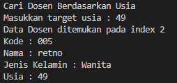

|  | Algorithm and Data Structure |
|--|--|
| NIM |  244107020241|
| Nama |  Andy Otani Dipo Yudho |
| Kelas | TI - 1I |
| Repository | [link] (https://github.com/andyotani/ALSD-sem2/blob/main/Jobsheet6/REPORT.md) |

# Labs #1 Programming Fundamentals Review
# jOBSHEET 6 - SEARCHING

## Percobaan 1 - 6.2. Searching / Pencarian Menggunakan Agoritma Sequential Search

...


**Jawaban Pertanyaan**
1. - `tampilPosisi` memberitahu Anda di mana data mahasiswa yang Anda cari (berdasarkan IPK) ditemukan dalam daftar, yaitu posisi atau indeksnya. Kalau tidak ditemukan, ia akan bilang "tidak ditemukan".
- `tampilDataSearch` jika data mahasiswanya ditemukan, akan menampilkan detail lengkap dari mahasiswa tersebut (NIM, nama, kelas, dan IPK). Kalau tidak ditemukan, ia juga akan bilang "tidak ditemukan".
Jadi, `tampilPosisi` fokus ke lokasi, sementara `tampilDataSearch` fokus ke isi data mahasiswanya. Keduanya saling melengkapi untuk memberi tahu hasil pencarian secara lengkap.
2. fungsi `break` digunakan untuk menghentikan atau keluar dari perulangan (loop) segera setelah kondisi yang ditentukan terpenuhi.
seperti mencari buku di rak `break` melakukan hal yang sama. Ketika IPK yang dicari (cari) sudah ditemukan di daftar mahasiswa `(listMhs[j].ipk)`, maka program akan langsung berhenti mencari dan keluar dari proses perulangan, tidak perlu memeriksa mahasiswa yang lain lagi. Ini membuat program jadi lebih cepat dan efisien.

## Percobaan 2 - Searching / Pencarian Menggunakan Binary Search

...


**Jawaban Pertanyaan**
1. Proses Divide
```java
        if (left <= right) {
            mid = (left + right) / 2;
        }
```

2. Proses Conquer
```java
         if (cari == listMhs[mid].ipk) {
                return (mid);
            } else if (cari > listMhs[mid].ipk) {
                return findBinarySearch(cari, mid+1, right);
            } else {
                return findBinarySearch(cari, left, mid-1);
            }
```

3. Jika data tidak urut, program tidak akan sesuai dengan yang diharapkan, karena algoritma binary search menggunakan pendekatan melalui perbandingan antara nilai yang dicari dengan nilai yang berada di index `mid`  

4. Output tidak akan sesuai, diperlukan modifikasi program khususnya dalam pemanggilan rekursinya. Berikut adalah modifikasi programnya

```java
    int findBinarySearchDescending (double cari, int left, int right) {
        int mid;
        if (left <= right) {
            mid = (left + right) / 2;
            if (cari == listMhs[mid].ipk) {
                return (mid);
            } else if (cari > listMhs[mid].ipk) {
                return findBinarySearchDescending(cari, left, mid-1);
            } else {
                return findBinarySearchDescending(cari, mid+1, right);
            }
        } 
        return -1;
    }   
```

5. Modifikasi Program 
```java
        System.out.print("Masukkan jumlah mahasiswa : ");
        int jmlMhs = sc.nextInt();

        while (jmlMhs > 5 || jmlMhs < 0) {
            System.out.println("Jumlah Mahasiswa max 5!");
            System.out.print("Masukkan jumlah mahasiswa : ");
            jmlMhs = sc.nextInt();
        }
```


# Latihan Praktikum
 **Tambah Data Dosen**


**Tampilkan Semua Dosen**


**Sorting Ascending Usia**


**Sorting Descending Usia**


**Cari Dosen berdasarkan nama**


**Cari Dosen berdasarkan usia**




1. metode `PencarianDataSequential` yang akan mencari data dosen berdasarkan nama. Metode ini harus menggunakan algoritma sequential search, artinya program akan memeriksa setiap data dosen satu per satu dari awal hingga akhir daftar sampai nama yang dicari ditemukan atau seluruh daftar sudah diperiksa.
2. metode `PencarianDataBinary` yang akan mencari data dosen berdasarkan usia. Metode ini harus menggunakan algoritma Binary Search. Penting untuk diingat bahwa Binary Search membutuhkan data yang sudah terurut (dalam kasus ini, usia harus terurut) agar dapat bekerja dengan efisien dan benar.
3. untuk yang ketiga menambahkan aturan di mana jika hasil pencarian (baik berdasarkan nama maupun usia) menemukan lebih dari satu data yang cocok, maka program harus menampilkan kalimat peringatan. Artinya, jika ada dua dosen atau lebih dengan nama yang sama persis atau usia yang sama persis dan Anda mencari nama/usia tersebut, sistem harus memberitahu bahwa ada duplikat.
