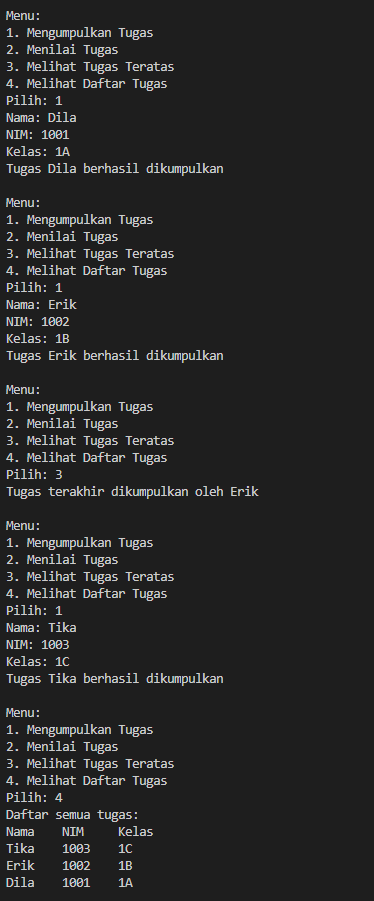
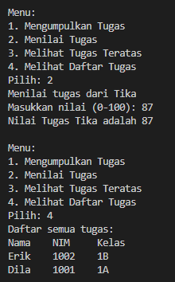
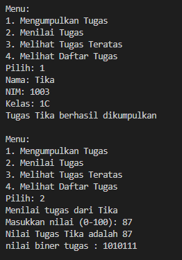
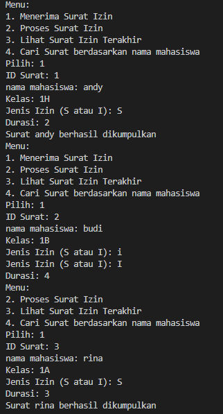
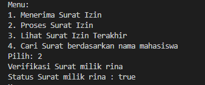
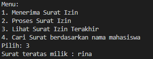
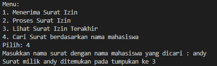

|  | Algorithm and Data Structure |
|--|--|
| NIM |  244107020241|
| Nama |  Andy Otani Dipo Yudho |
| Kelas | TI - 1I |
| Repository | [link] (https://github.com/andyotani/ALSD-sem2/blob/main/Jobsheet9/REPORT.md) |

# Labs #1 Programming Fundamentals Review
# jOBSHEET 9 - STACK

## Percobaan 1 - Mahasiswa Mengumpulkan Tugas

...



**Jawaban Pertanyaan**
1.  ```java
    public void print() {
        for(int i = top; i >= 0; i--) {
            System.out.println(stack[i].nama + "\t" + stack[i].nim + "\t" + stack[i].kelas);
        }
        System.out.println("");
    }
`
2. Stack dapat menampung 5 data tugas mahasiswa.`StackTugasMahasiswa04 stack = new StackTugasMahasiswa04(5);`
3. Jika stack sudah penuh dan kita mencoba menambahkan elemen lagi tanpa pengecekan `!isFull()`, maka akan terjadi `ArrayIndexOutOfBoundsException`. Ini karena `top` akan melebihi batas indeks array `stack`, dan program akan crash.
dampaknya maka ketika `top` mencapai `size - 1` (stack penuh) dan ada upaya push lagi, top akan diinkrementasi menjadi `size`, dan `stack[top]` akan mencoba mengakses `stack[size]`. Karena array di Java memiliki indeks dari `0` hingga `size - 1`, indeks size tidak valid, sehingga akan menyebabkan `ArrayIndexOutOfBoundsException` saat runtime.
4. Tambahkan method melihat tugas pertama
```java
    Mahasiswa25 peekBottom() {
        if (!isEmpty()) {
            return stack[0];
        } else {
            System.out.println("Stack kosong! Tidak ada tugas yang dikumpulkan");
            return null;
        }
    }
```

5. Tambah method menghitung jumlah tugas
```java
    int jumlahTugas() {
        if (!isEmpty()) {
            return top + 1;
        } else {
            return 0;
        }
    }
```


## Percobaan 2 -  Konversi Nilai Tugas ke Biner 

...



**Jawaban Pertanyaan**
1. sebuah objek `StackKonversi` dibuat untuk menyimpan sisa hasil pembagian bilangan desimal dengan 2. Selama nilai lebih besar dari 0, program akan menghitung sisa pembagian `nilai % 2`, lalu menyimpannya ke dalam stack menggunakan `stack.push(sisa)`. Nilai kemudian dibagi 2 menggunakan `nilai /= 2` untuk melanjutkan proses konversi. Setelah seluruh sisa pembagian disimpan dalam stack, program akan membentuk string biner dari data yang ada di stack. Ini dilakukan dengan cara mengambil satu per satu elemen dari stack menggunakan stack.`pop()` dan menambahkannya ke variabel `biner`. Karena stack bersifat LIFO (Last In First Out), hasil konversi yang terbentuk memiliki urutan biner yang benar. Setelah stack kosong, string biner yang terbentuk dikembalikan sebagai hasil konversi.
2. input masih bisa dijalankan dan tetap sesuai logika. Namun, jika nilai yang diinputkan adalah negatif, maka akan terjadi kemungkinan infinite loop atau hasil yang tidak valid. Ini karena kondisi `while (nilai != 0)` akan terus bernilai true untuk angka negatif, dan pembagian `nilai /= 2` akan membuat nilai semakin kecil (negatif) dan tidak pernah mencapai nol.


# Latihan

1. **Menerima Surat Izin**

2. **Proses Surat Izin**

3. **Lihat Surat Izin Terakhir**

4. **Cari Surat berdasarkan nama mahasiswa**


**Penjelasan**
1. Ada dua bagian utama. Surat04.java adalah cetakan (blueprint) untuk membuat objek surat, yang menyimpan informasi seperti ID surat, nama mahasiswa, kelas, jenis izin, durasi, dan status verifikasi. StackSurat04.java adalah wadah atau "tumpukan" yang digunakan untuk menyimpan objek-objek surat ini. Di sini, surat-surat ditumpuk satu per satu, dan hanya surat paling atas yang bisa diambil atau dilihat langsung, seperti menumpuk piring.
2. StackSurat04 memiliki operasi-operasi dasar untuk mengelola surat:
    - `push()` Menambahkan surat baru ke paling atas tumpukan, asalkan tumpukan belum penuh.
    - `pop()` Mengambil surat yang paling atas dari tumpukan, seperti mengambil piring paling atas dari tumpukan.
    - `peek()` Melihat surat yang paling atas tanpa mengambilnya.
    - `cariSurat()` Mencari surat berdasarkan nama mahasiswa dan mengembalikan posisinya di tumpukan.
3. `SuratDemo04.`java adalah program utama yang menampilkan menu interaktif kepada pengguna.
- Menerima surat izin baru (menambahkan ke stack).
- Memproses atau memverifikasi surat yang paling atas (mengambil dari stack).
- Melihat surat yang terakhir masuk/teratas.
- Mencari surat berdasarkan nama mahasiswa. Program ini memastikan hanya 5 surat yang bisa ditampung karena stack dibuat dengan ukuran 5.
